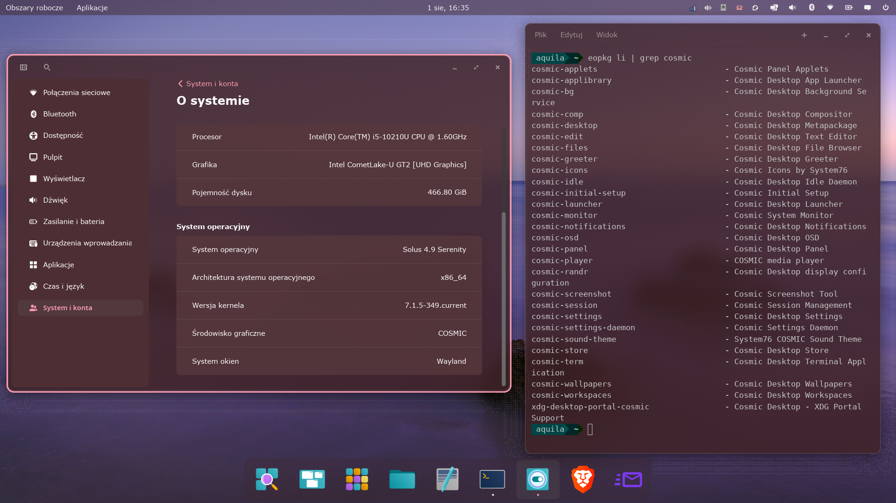

# COSMIC Desktop na Solus

## Opcja 1 — z katalogu

```bash
cd ~/Pobrane/cosmic_paczki/

for pkg in xdg-desktop-portal-cosmic cosmic-applets cosmic-panel cosmic-files \
           cosmic-applibrary cosmic-comp cosmic-osd cosmic-randr cosmic-settings \
           cosmic-workspaces cosmic-wallpapers cosmic-greeter cosmic-idle cosmic-bg \
           cosmic-sound-theme cosmic-settings-daemon cosmic-notifications cosmic-session \
           cosmic-icons cosmic-edit cosmic-initial-setup cosmic-screenshot cosmic-term \
           cosmic-monitor cosmic-store cosmic-player cosmic-launcher; do
    sudo eopkg it "$pkg"*.eopkg
done

sudo eopkg it cosmic-desktop*.eopkg
```

## Opcja 2 — lokalne repo

```bash
mkdir -p ~/Bin/LocalRepo
cp ~/Pobrane/cosmic_paczki/*.eopkg ~/Bin/LocalRepo/
sudo eopkg index --skip-signing ~/Bin/LocalRepo/
sudo eopkg add-repo local-cosmic file://$HOME/Bin/LocalRepo/ -i 0
sudo eopkg it cosmic-desktop
```

Aktualizacja repo później: powtórz `eopkg index`.




## Licencja i Prawa Autorskie

* **Receptury pakietów (`package.yml`):** Udostępniane na licencji **[MPL-2.0](https://www.mozilla.org/en-US/MPL/2.0/)**. Receptury powstały na podstawie szablonów przygotowanych przez zespół **[AerynOS](https://github.com/AerynOS)** (Copyright © AerynOS Developers).
* **Oprogramowanie COSMIC:** Składniki środowiska COSMIC Desktop są własnością **System76** oraz niezależnych twórców i podlegają ich własnym licencjom upstreamowym (głównie MIT, Apache-2.0 oraz GPL-3.0, w zależności od konkretnego komponentu).
